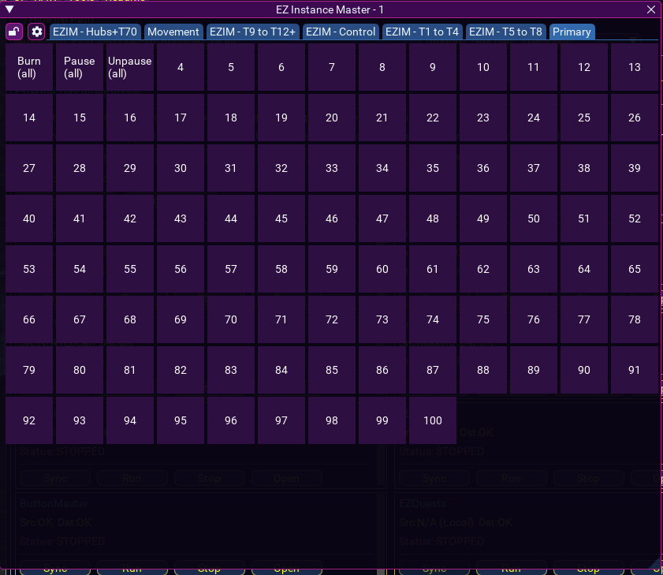
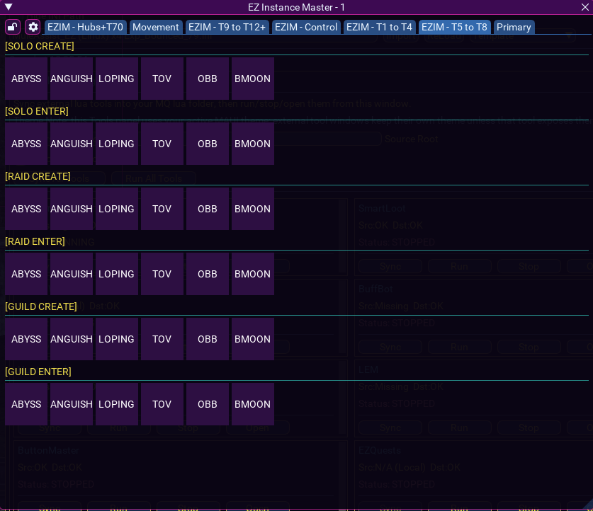
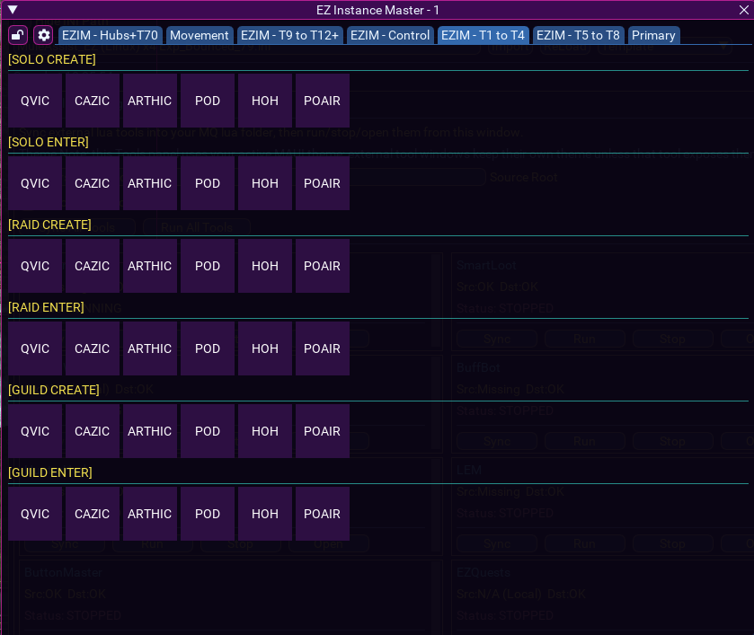
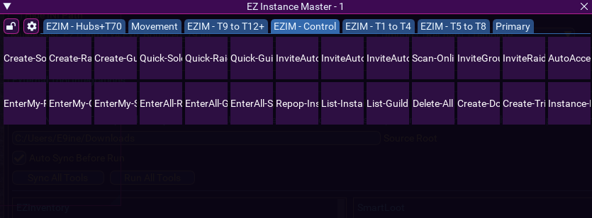
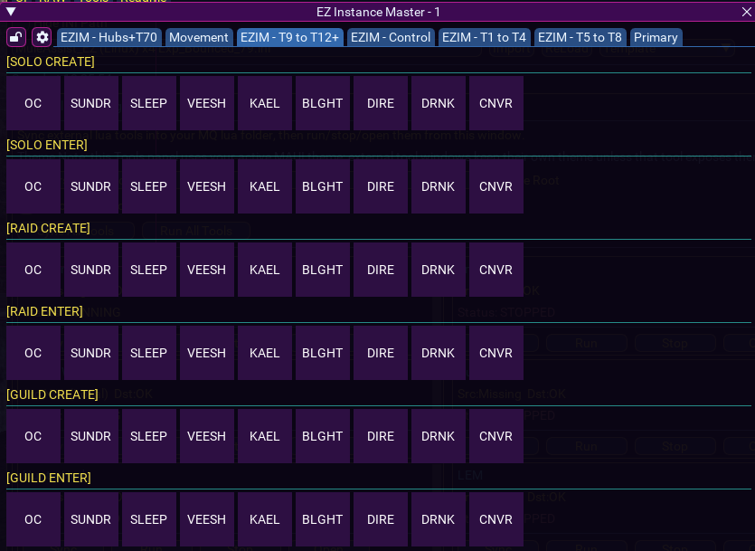
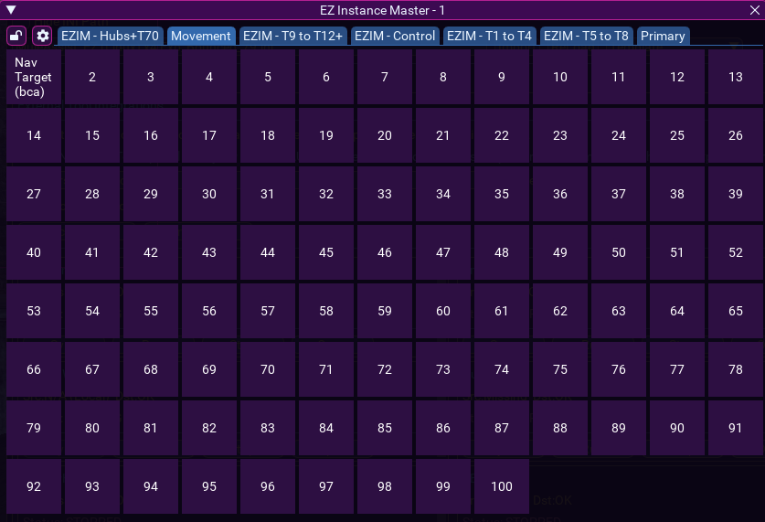
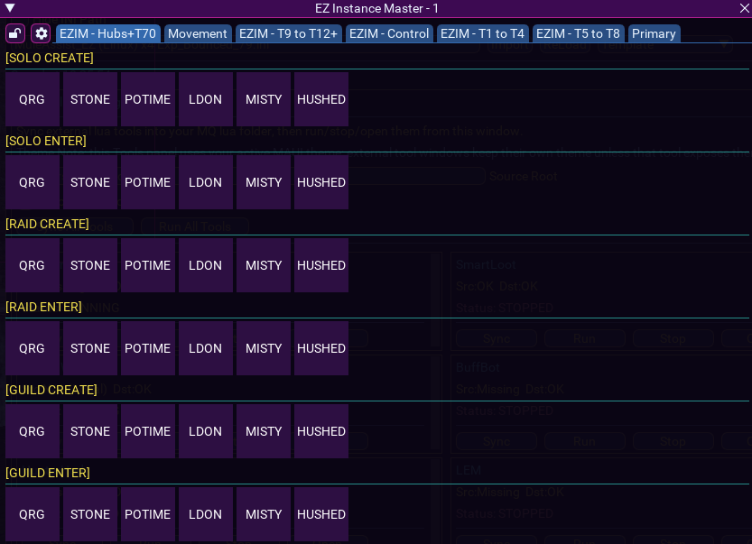

# EZ Instance Master (MQ Lua)

Standalone package of your `ezinstancemaster` tool with setup docs and screenshot-based usage sections.

## What this package includes

- `lua/ezinstancemaster/init.lua` (main entrypoint)
- `lua/ezinstancemaster/ezimHotbarClass.lua`
- `lua/ezinstancemaster/ezimButtonHandlers.lua`
- `lua/ezinstancemaster/ezimEditButtonPopup.lua`
- `lua/ezinstancemaster/ezimSettings.lua`
- `lua/ezinstancemaster/lib/*`
- `lua/ezinstancemaster/extras/themes.lua`
- `docs/images/*` (your included screenshots)

## Requirements

- MacroQuest with Lua + ImGui enabled
- `actors` library
- `mq.ICONS`
- `mq.Set`
- `Zep` (used by button editor popup)

## Install

1. Copy the repo `lua` folder contents into your MQ `lua` folder.
2. Confirm this exists:
   - `.../lua/ezinstancemaster/init.lua`
3. Start the tool:

```text
/lua run ezinstancemaster
```

## Primary commands

- `/ezim` toggles/opens EZ Instance Master UI
- `/ezimexec <set> <index>` executes a button slot directly
- `/ezimcopy <charConfigKey>` copies window layout/profile from another char key
- `/eziminstances <action>` instance automation command group

## /eziminstances actions

- `install`
- `font awesome|readable|compact`
- `create solo|guild|raid [zone|here]`
- `inviteauto solo|guild|raid [zone|here]`
- `scanonline`
- `invitegroup`
- `inviteraid`
- `autoacceptsetup inviter|me`
- `quick solo|guild|raid [zone|here]`
- `enter solo|guild|raid [owner|me] [zone|here]`
- `enterall solo|guild|raid [owner|me] [zone|here]`
- `repop`
- `help`

## UI guide (from your screenshots)

### Main hotbar layout and tab sets
Shows the main window with set tabs and full button grid.



### T5-T8 set buttons
Preset solo/raid/guild create + enter rows for T5-T8 zones.



### T1-T4 set buttons
Preset solo/raid/guild workflows for T1-T4 zones.



### Control tab
Centralized control actions (create, quick create, enterall, invite tools, repop, list/help actions).



### T9-T12+ set buttons
Preset zone rows for late-tier instance workflows.



### Movement tab
General movement/utility slot layout.



### Hubs + T70 set
Hub-tier preset rows with create/enter options.



## Config and data location

This script writes profile/config data under MQ config dir:

- `mq.configDir/EZInstanceMaster/`
- backup snapshots in `mq.configDir/EZInstanceMaster-Backups/`
- optional custom theme file: `mq.configDir/EZ_Instance_Master_Theme.lua`

## Notes

- This package is your current local `ezinstancemaster` version.
- Zone aliases and preset set generation are already built into `init.lua`.
