# NPC Dialog Console (Current Build)

This package contains your current working build of **NPC Dialog Console** and its active runtime data under `config/npc_dialog_logger`.

The guide below is ordered as a practical workflow: start capture, review/accept, export website, then run DBStr/Spells remediation.

## Package contents

- `lua/npc_dialog_console.lua` - main script
- `config/npc_dialog_logger/` - live data, snapshots, patch logs, site export, cache
- `docs/images/` - ordered screenshots used in this guide

## What this tool does

- Captures NPC dialog and popup responses in real time.
- Parses clickable dialog links and associates text with NPC records.
- Stores records in pending/accepted sets for review control.
- Exports a browsable website (`site_export`) from accepted data.
- Runs a DBStr/Spells builder to detect and repair description/mapping issues.
- Writes patched `dbstr_us` / `spells_us` outputs and logs changes.

## Quick start

1. Put `npc_dialog_console.lua` in your MQ `lua` folder.
2. Run:

```text
/lua run npc_dialog_console
```

3. Use command bind:

```text
/ndc
```

## Command reference

- `/ndc` or `/ndc toggle` - show/hide window
- `/ndc show` - show window
- `/ndc hide` - hide window
- `/ndc start` - start logging
- `/ndc stop` - stop logging
- `/ndc accept` - accept pending records
- `/ndc reject` - reject pending records
- `/ndc save` - save accepted records
- `/ndc dbstr scan` - scan DBStr/Spells for issues
- `/ndc dbstr scanall` - full scan (explicit all)
- `/ndc dbstr scanrelevant` - dialog-relevant-only scan
- `/ndc dbstr importmd` - import markdown hints
- `/ndc dbstr propose` - generate proposals from dialog/markdown
- `/ndc dbstr write` - write patched files
- `/ndc quit` - stop script loop

## Guided workflow (ordered)

### 1) Main console idle state
Start here to verify the tool is loaded and controls are visible.

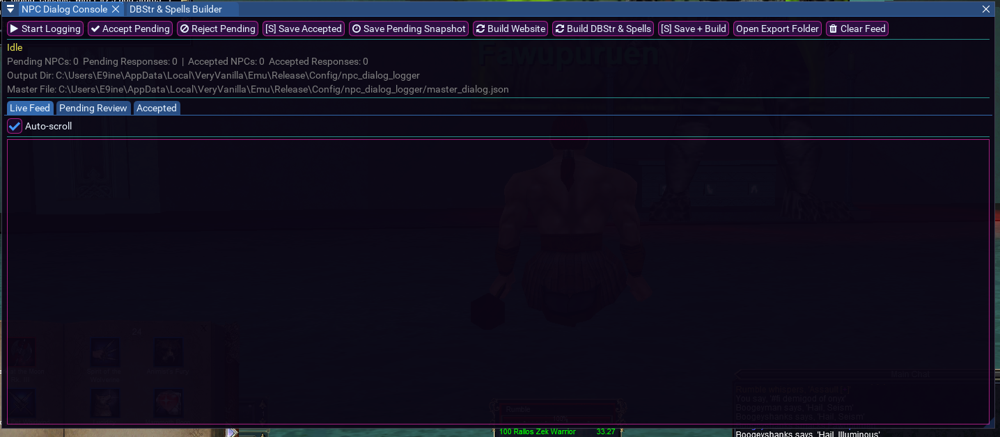

### 2) Live capture while logging
Turn on logging and interact with NPC dialogs; incoming lines stream into Live Feed.

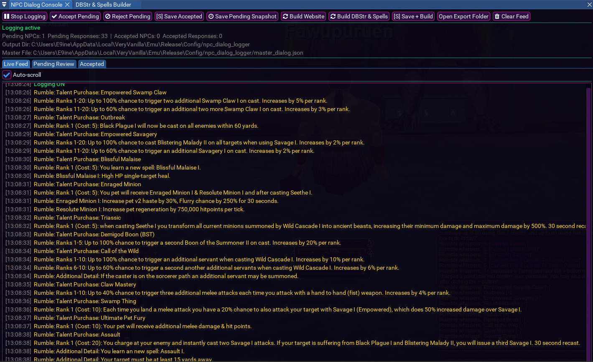

### 3) Validate captured feed against in-game popup
Use side-by-side view to confirm parsed output reflects what NPC UI presented.

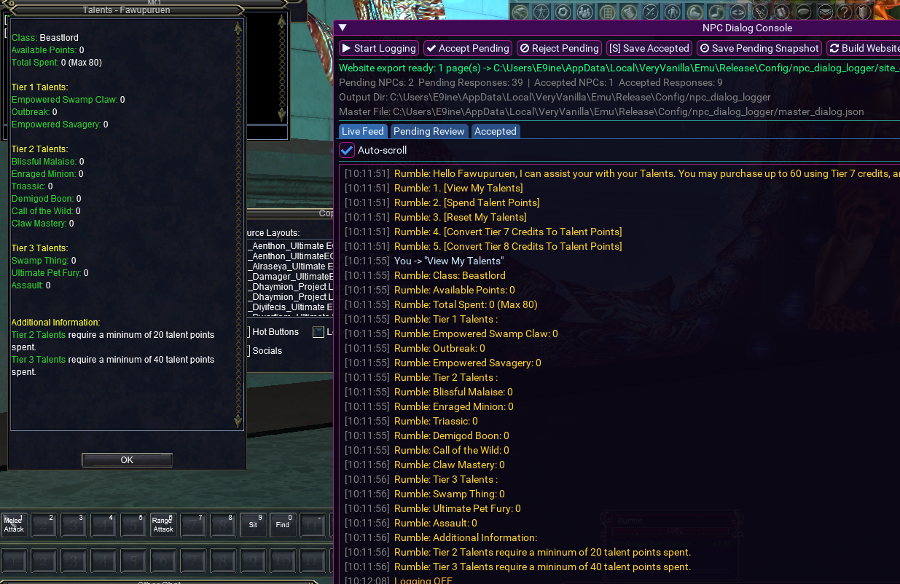

### 4) Dialog link source lines
Shows the raw linked/whisper-style lines that feed spell/name extraction.

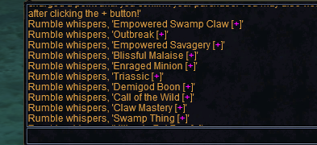

### 5) Accept pending dialog sets
After reviewing pending content, use **Accept Pending** to move records into accepted state.

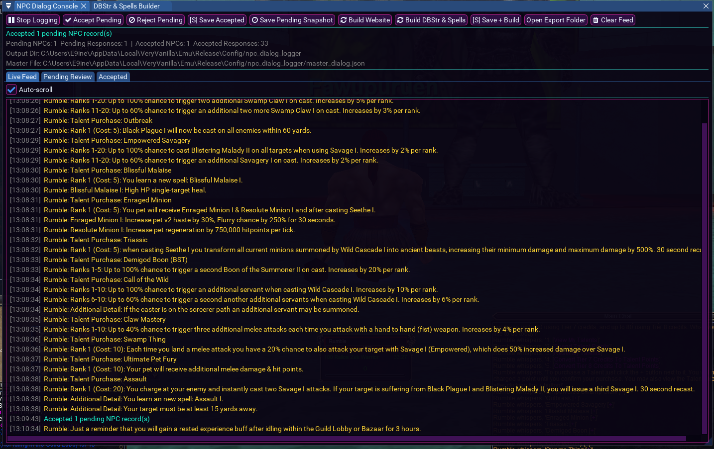

### 6) Save and build export artifacts
Use Save/Build actions to persist and generate web output.

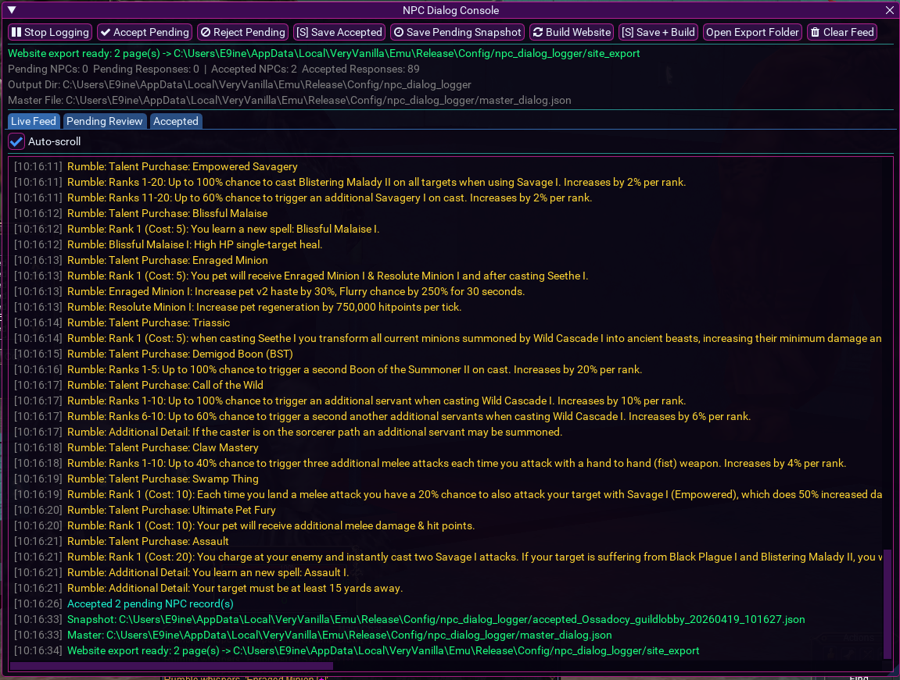

### 7) Configure DBStr/Spells builder inputs
Set `dbstr_us.txt`, `spells_us.txt`, optional markdown hints, and scan behavior before running analysis.

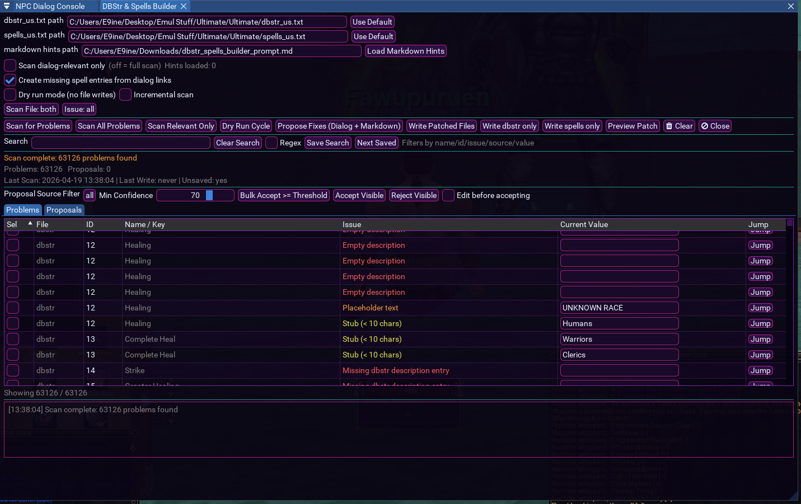

### 8) Scan problems view
Run scans and review classified issues (missing descriptions, empty text, missing spell entries, etc.).

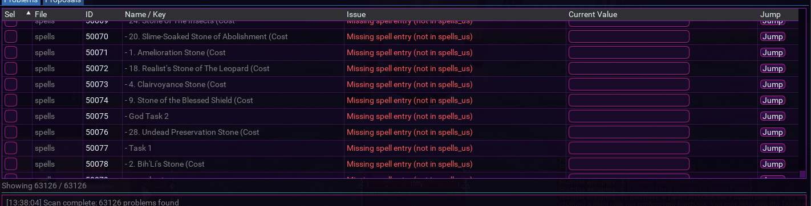

### 9) Problem detail browsing and jumping
Use filters/search/jump controls to navigate large problem sets quickly.

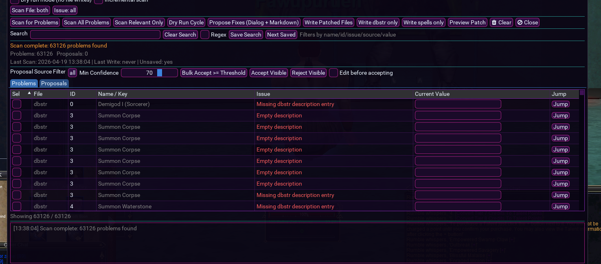

### 10) Proposal generation overview
Generate suggestions from dialog + markdown and review match rates.

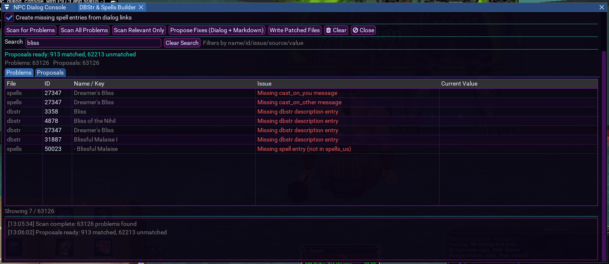

### 11) Select and accept proposal rows
Use row selection + acceptance tools to batch apply viable fixes.

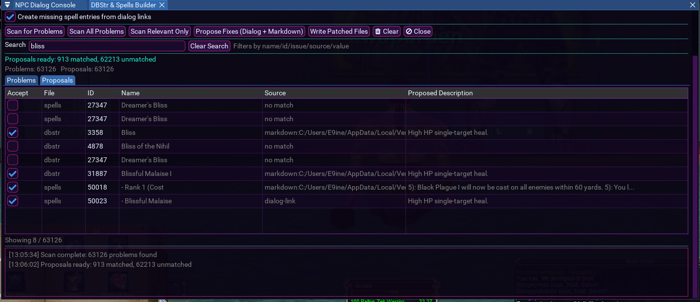

### 12) Hint-assisted proposal quality
With markdown hints loaded, proposals can improve source confidence/coverage.

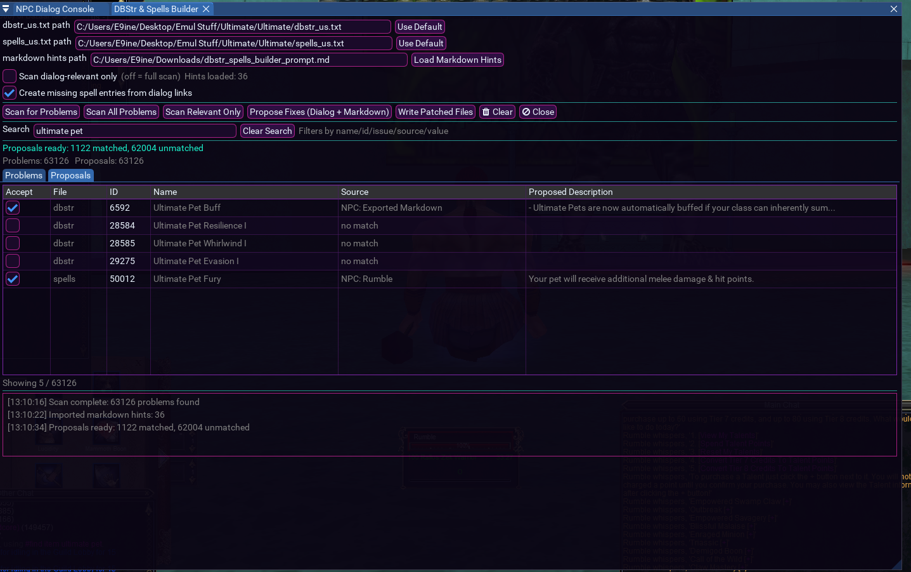

## Output and file locations

Runtime base folder:

- `config/npc_dialog_logger/`

Important outputs:

- `master_dialog.json` - merged master record set
- `accepted_*.json` - accepted snapshots
- `scan_cache.json` - incremental scan cache
- `dbstr_us_patched.txt` - patched DBStr output
- `spells_us_patched.txt` - patched Spells output
- `patch_log_*.txt` - write/patch logs
- `site_export/` - generated website pages

## Operational notes

- Use **Save Pending Snapshot** before major cleanup runs.
- Use **Dry run mode** for validation-only cycles.
- Use **Incremental scan** when iterating after first full pass.
- Keep source files backed up before writing patched outputs.
- The included config folder is your current working state; treat it as data-bearing, not a blank template.
