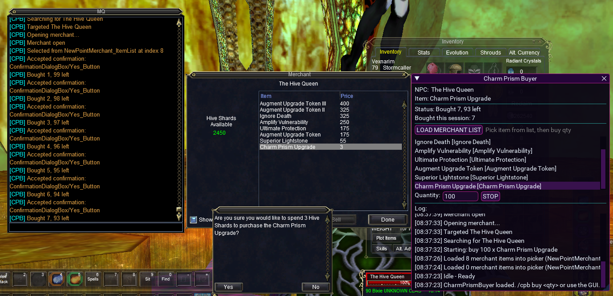

# Prism (Charm Prism Buyer) - MQ Lua

Standalone package of your Prism buyer tool, including usage guide and screenshot.

## What this package includes

- `lua/prism/prism.lua` (main script)
- `docs/images/buyer.png` (your provided screenshot)

## Purpose

Automates repeated purchases of **Charm Prism Upgrade** from **The Hive Queen** through merchant window interaction and confirmation handling.

## Requirements

- MacroQuest with Lua and ImGui enabled
- Access to the target NPC/merchant in-game

## Install

1. Copy this repo `lua` folder into your MQ `lua` folder.
2. Confirm this file exists:
   - `.../lua/prism/prism.lua`
3. Start it:

```text
/lua run prism/prism
```

## Commands

Primary bind command:

- `/cpb buy <qty>` start buying quantity
- `/cpb stop` stop current run
- `/cpb status` print current state
- `/cpb debug [on|off]` debug mode

Diagnostic helpers built in:

- `/cpb diag`
- `/cpb dumpwin`
- `/cpb dumpwintree`
- `/cpb dumplist [rows]`
- `/cpb dumpmerchant [rows]`
- `/cpb winlist [rows]`
- `/cpb selprobe [maxIndex]`
- `/cpb scan`
- `/cpb probelist [maxIndex]`
- `/cpb probecoords [stepY]`

## UI workflow

1. Run script and keep the Prism window open.
2. Target/face the merchant area.
3. Click **LOAD MERCHANT LIST**.
4. Select desired item from list.
5. Enter quantity and click **BUY NOW**.
6. Use **STOP** to interrupt safely.

## Screenshot



## Notes

- Script title in UI/binds is **CharmPrismBuyer** with `/cpb` command namespace.
- The script exits cleanly when the ImGui window is closed.
- Debug output files are written to `mq.luaDir` with `prism_*` filenames.
