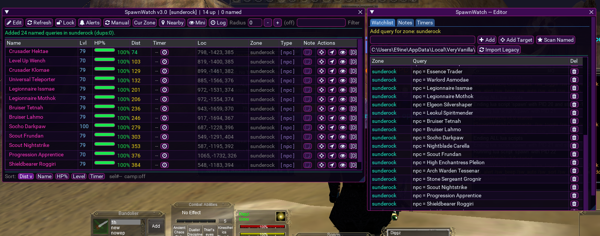
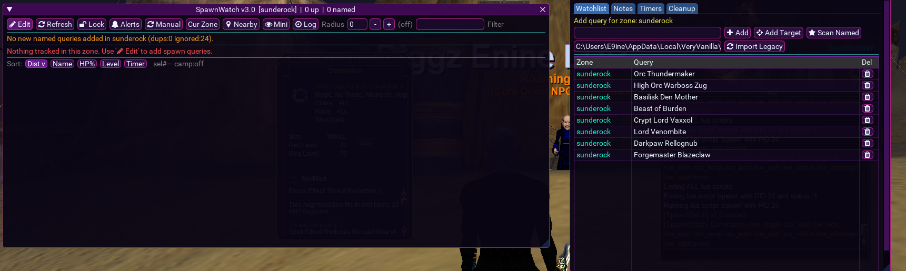
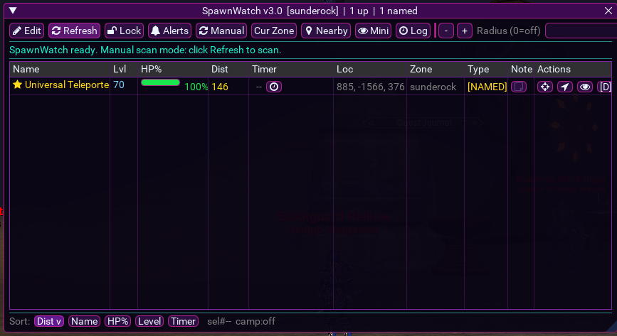
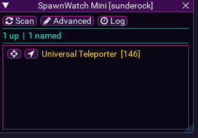
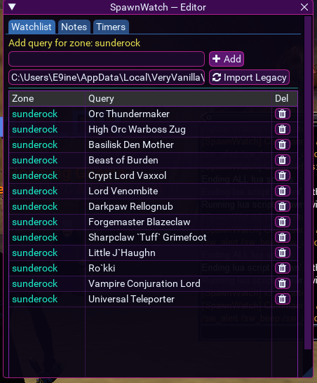
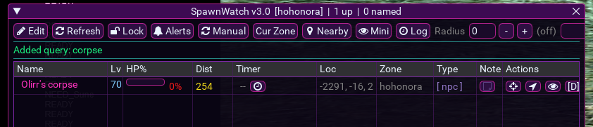

# SpawnWatch v3.0 (MQ Lua)

Standalone shareable package for your SpawnWatch tool from MQ Lua, including runtime data files and screenshot-guided usage docs.

## What this package includes

- `lua/spawn.lua` (main SpawnWatch v3.0 script)
- `lua/spawnwatch/` runtime data folder
  - `watchlist.json`
  - `config.json`
  - `timers.json`
  - `notes.json`
  - `ignored_named.json`
- `docs/images/` screenshot gallery used in this guide

## Requirements

- MacroQuest with Lua enabled
- MQ ImGui bindings (`require('ImGui')`)
- `mq/Icons` module (bundled with modern MQ Lua)
- Optional: `mq2nav` plugin for the Navigate action button

## Install

1. Copy this repo's `lua` folder contents into your MQ `lua` folder.
2. Ensure you have:
   - `.../lua/spawn.lua`
   - `.../lua/spawnwatch/` (with JSON files)
3. In MQ, start SpawnWatch:

```text
/lua run spawn
```

## Core commands

- `/sw_toggle` show or hide main window
- `/sw_edit` open watchlist editor
- `/sw_lock` toggle lock/move behavior
- `/sw_alert` toggle alert text/popup behavior
- `/sw_beep` toggle alert beep
- `/sw_auto on|off` toggle periodic scanning
- `/sw_sort dist|name|hp|level|timer` set sort mode
- `/sw_radius <n>` camp radius filter (`0` disables)
- `/sw_import [path]` import legacy watch data
- `/sw_addtarget` add current target to current zone watchlist
- `/sw_addnamed` scan zone named mobs and add queries

Legacy aliases still supported:
- `/showspawns`
- `/sm_edit`
- `/sm_lock`

## UI guide (with screenshots)

### 1) Main window + editor workflow
Main table on the left with tracking/actions, editor on the right for watchlist management and legacy import.



### 2) Empty/filtered state and editor list management
Shows how main window behaves when no tracked rows match and how queries are managed in editor.



### 3) Tracked named row state
Named spawn detected with HP/distance/location/actions visible.



### 4) Mini HUD mode
Compact mode for quick scan/target/nav access.



### 5) Editor detail view
Watchlist tab with zone-query rows and delete controls.



### 6) Alternate zone/target example
Another live tracking example showing zone-specific row behavior.



## Data files and persistence

SpawnWatch reads and writes these files under `lua/spawnwatch/`:

- `watchlist.json`: zone -> query list
- `notes.json`: per spawn notes (`zone:name`)
- `timers.json`: per spawn timer ranges
- `ignored_named.json`: ignored named entries for auto-add workflows
- `config.json`: lock/alerts/scan/sort/radius/window preferences

## Notes

- Main script entrypoint is `spawn.lua`, so run command is `/lua run spawn`.
- `spawnwatch/init.lua` is included from your workspace bundle for compatibility/history but v3.0 entrypoint remains `spawn.lua`.

## Credits

- Original source inspiration: https://github.com/andude2
- This version was heavily revamped from the original and differs in behavior/layout/features.
